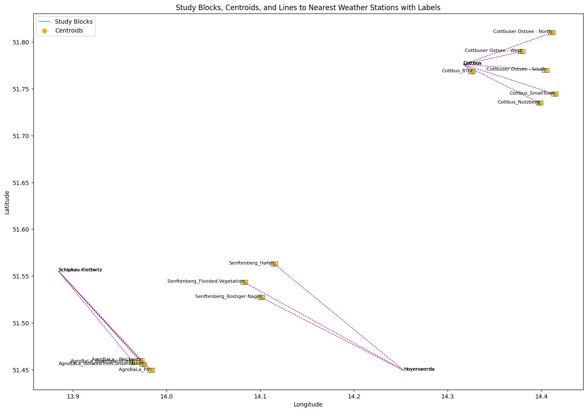

# Nearest-Weather-Station-Finder-Lausitz-Study


## Google Colab: https://colab.research.google.com/drive/1Q0a07TV23xuD-ScJvYB0rI5msIpzcIsC?usp=sharing


## 1. Setup and Library Installation
Before starting the analysis, ensure you have the necessary libraries installed and imported.
```
# Install necessary libraries
!pip install geopandas
!pip install matplotlib
!pip install shapely

# Import required libraries
import geopandas as gpd
import pandas as pd
import matplotlib.pyplot as plt
from shapely.geometry import Polygon, Point
import xml.etree.ElementTree as ET
```
## 2. Data Loading
Load the weather station data and Lausitz boundary data.
```
# Load the weather station data
weather_station_data = pd.read_csv('/path_to_your_data/lausitz_station.csv')

# Convert the weather stations data to a GeoDataFrame
weather_stations_gdf = gpd.GeoDataFrame(weather_station_data, 
                                        geometry=gpd.points_from_xy(weather_station_data.geoLaenge, 
                                                                    weather_station_data.geoBreite))

# Load the Lausitz boundary shapefile data
lausitz_boundary = gpd.read_file('/path_to_your_extracted_shapefile/Lusatia_Boundary_Districts_EPSG4326.shp')
```
## 3. Initial Visualization: Lausitz Boundary and Weather Stations
```
# Plot Lausitz Boundary and Weather Stations
fig, ax = plt.subplots(figsize=(12, 10))
lausitz_boundary.boundary.plot(ax=ax, color='blue', linewidth=1.5, label='Lausitz Boundary')
weather_stations_gdf.plot(ax=ax, color='red', markersize=50, label='Weather Stations')
ax.set_xlabel('Longitude')
ax.set_ylabel('Latitude')
ax.set_title('Lausitz Boundary and Weather Stations')
ax.legend()
plt.tight_layout()
plt.show()
```




## 4. Data Extraction: Study Blocks from KML File
Extract study block data manually from the provided KML file.
```
# Manually parse the KML file to extract study blocks from the "LIL_KliBioTo_StudySites2023" layer
tree = ET.parse('/path_to_your_data/Heatwave Monitoring - 15_08_2023.kml')
root = tree.getroot()
ns = {'kml': 'http://www.opengis.net/kml/2.2'}
study_blocks_data = []
for folder in root.findall(".//kml:Folder", ns):
    folder_name = folder.find("kml:name", ns).text
    if folder_name == "LIL_KliBioTo_StudySites2023":
        for placemark in folder.findall(".//kml:Placemark", ns):
            block_name = placemark.find("kml:name", ns).text
            coordinates_text = placemark.find(".//kml:Polygon/kml:outerBoundaryIs/kml:LinearRing/kml:coordinates", ns).text.strip()
            coordinates = [(float(coord.split(',')[0]), float(coord.split(',')[1])) for coord in coordinates_text.split()]
            study_blocks_data.append({'Block_Name': block_name, 'geometry': Polygon(coordinates)})
```

## 5. Visualization: Study Blocks with Lausitz Boundary and Weather Stations
```
# Convert the list of study blocks data to a GeoDataFrame
study_blocks_layer_manual = gpd.GeoDataFrame(study_blocks_data)

# Plot Lausitz Boundary, Weather Stations, and Study Blocks
fig, ax = plt.subplots(figsize=(12, 10))
lausitz_boundary.boundary.plot(ax=ax, color='blue', linewidth=1.5, label='Lausitz Boundary')
weather_stations_gdf.plot(ax=ax, color='red', markersize=50, label='Weather Stations')
study_blocks_layer_manual.boundary.plot(ax=ax, color='green', linewidth=0.8, label='Study Blocks')
ax.set_xlabel('Longitude')
ax.set_ylabel('Latitude')
ax.set_title('Lausitz Boundary, Weather Stations, and Study Blocks')
ax.legend()
plt.tight_layout()
plt.show()
```

<!-- -->

## 6. Find Nearest Weather Station for Each Study Block
Define a function to find the nearest weather station for each study block centroid and apply it.
```
# Function to find the nearest weather station for each centroid
def find_nearest_station(centroid, stations):
    distances = stations['geometry'].distance(centroid)
    nearest_index = distances.idxmin()
    nearest_station = stations.loc[nearest_index]
    return nearest_station['Stationsname'], distances[nearest_index]

# Calculate the centroid for each study block and find the nearest weather station
study_blocks_layer_manual['centroid'] = study_blocks_layer_manual['geometry'].centroid
study_blocks_layer_manual['Nearest_DWD'], study_blocks_layer_manual['Distance'] = zip(*study_blocks_layer_manual['centroid'].apply(find_nearest_station, stations=weather_stations_gdf))
study_blocks_layer_manual['Distance'] = study_blocks_layer_manual['Distance'] * 6371
```

## 7. Visualization: Centroids and Lines to Nearest Weather Stations
```
# Plot Study Blocks, Centroids, and Lines to Nearest Weather Stations
fig, ax = plt.subplots(figsize=(12, 10))
study_blocks_layer_manual.boundary.plot(ax=ax, color='green', linewidth=0.8, label='Study Blocks')
study_blocks_layer_manual['centroid'].plot(ax=ax, color='orange', markersize=50, label='Centroids')

for _, row in study_blocks_layer_manual.iterrows():
    nearest_station_coords = weather_stations_gdf[weather_stations_gdf['Stationsname'] == row['Nearest_DWD']]['geometry'].iloc[0].coords[0]
    ax.plot([row['centroid'].x, nearest_station_coords[0]], 
            [row['centroid'].y, nearest_station_coords[1]], 
            color='purple', linestyle='--', linewidth=0.8)

ax.set_xlabel('Longitude')
ax.set_ylabel('Latitude')
ax.set_title('Study Blocks, Centroids, and Lines to Nearest Weather Stations')
ax.legend()
plt.tight_layout()
plt.show()
```

<!-- -->


## 8. Summary
Finally, print a summary dataframe showing the nearest weather station for each study block and the corresponding distance.
```
# Print Summary Dataframe
summary_df_new_manual = study_blocks_layer_manual[['Block_Name', 'Nearest_DWD', 'Distance']]
summary_df_new_manual.columns = ['Block_Name', 'Nearest_DWD', 'Distance (km)']
print(summary_df_new_manual)
```

```
                           Block_Name         Nearest_DWD  Distance (km)
0                AgroBaLa - Peickwitz  Schipkau-Klettwitz     827.590601
1   AgroBaLa_IsolatedTreeConservation  Schipkau-Klettwitz     859.385952
2             AgroBaLa_OpenSpaceField  Schipkau-Klettwitz     802.354061
3                        AgroBaLa_PV   Schipkau-Klettwitz     924.240790
4                         Cottbus_BTU             Cottbus      76.124773
5                    Cottbus_Nutzberg             Cottbus     581.102096
6                   Cottbus_SmallTown             Cottbus     653.515461
7             Cottbuser Ostsee - West             Cottbus     406.068250
8            Cottbuser Ostsee - South             Cottbus     561.289805
9            Cottbuser Ostsee - North             Cottbus     638.925492
10         Senftenberg_Rostiger Nagel         Hoyerswerda    1090.178549
11     Senftenberg_Flooded Vegetation         Hoyerswerda    1239.986323
12                  Senftenberg_Hafen         Hoyerswerda    1141.104257
```
